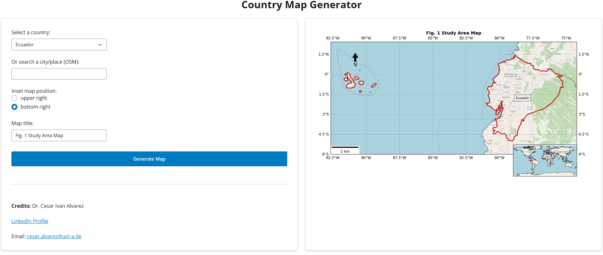
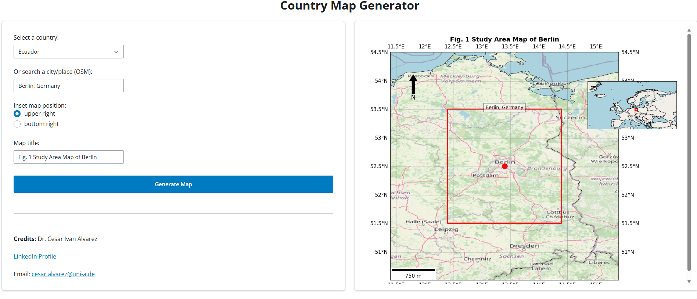

# 🌍 Country Map Generator

**Country Map Generator** is a web-based Python Shiny application that allows researchers, students, and educators to generate **publication-ready maps** of countries or specific places for use in scientific papers, theses, presentations, and reports.

## 🧭 Features

- Select a **country** from a worldwide list based on a GeoJSON file.
- Alternatively, **search a city or place** using OpenStreetMap (OSM).
- Automatically detects and zooms to the selected region.
- Option to **customize map title**.
- Choose **inset map position** (upper right or bottom right).
- **Displays a bounding box** or **marker** in the inset map to highlight the area of study.
- Outputs **high-resolution map images** with:
  - Country/region borders
  - North arrow
  - Coordinate grid
  - Scale bar
  - Inset location map

## 🚀 Live Demo

Visit the live app hosted on ShinyApps.io:

👉 [https://cesarivanalvarez.shinyapps.io/country-map/](https://cesarivanalvarez.shinyapps.io/country-map/)

## 📷 Screenshots

### Country Selection Example


### City Search Example


## 🔧 Installation

You can run this app locally using Python ≥ 3.10.

### 1. Clone the Repository

```bash
git clone https://github.com/osoivan/country-map-generator.git
cd country-map-generator
```

### 2. Create a Virtual Environment

```bash
conda create -n country_map_app python=3.10
conda activate country_map_app
```

### 3. Install Requirements

```bash
pip install -r requirements.txt
```

### 4. Run the App Locally

```bash
python -m shiny run --reload app.py
```

Then open your browser to [http://127.0.0.1:8000](http://127.0.0.1:8000).

## 📁 File Structure

```
country-map-generator/
│
├── app.py                   # Main Shiny Python application
├── world-administrative-boundaries.geojson  # GeoJSON with country geometries
├── requirements.txt         # Python dependencies
├── docs/
│   └── example_map_ecuador.png
│   └── example_map_berlin.png
├── README.md
```

## 📦 Dependencies

- [Shiny for Python](https://shiny.posit.co/py/)
- GeoPandas
- Cartopy
- Matplotlib
- geopy
- matplotlib-scalebar

## 🧠 Use Cases

- Quickly generate clean and consistent **study area maps** for scientific publications.
- Avoid the need for complex GIS software.
- Ideal for:
  - Remote sensing studies
  - Environmental impact papers
  - Climate vulnerability assessments
  - Academic theses

## 👨‍💻 Authors

**Dr. Cesar Ivan Alvarez**  
University of Augsburg  
📧 cesar.alvarez@uni-a.de  
🔗 [LinkedIn Profile](https://www.linkedin.com/in/cesar-ivan-alvarez-0847253a/)

## 📄 License

This project is licensed under the **MIT License** – see the [LICENSE](LICENSE) file for details.

---

### ⭐️ If you find this project useful, please consider giving it a star!
