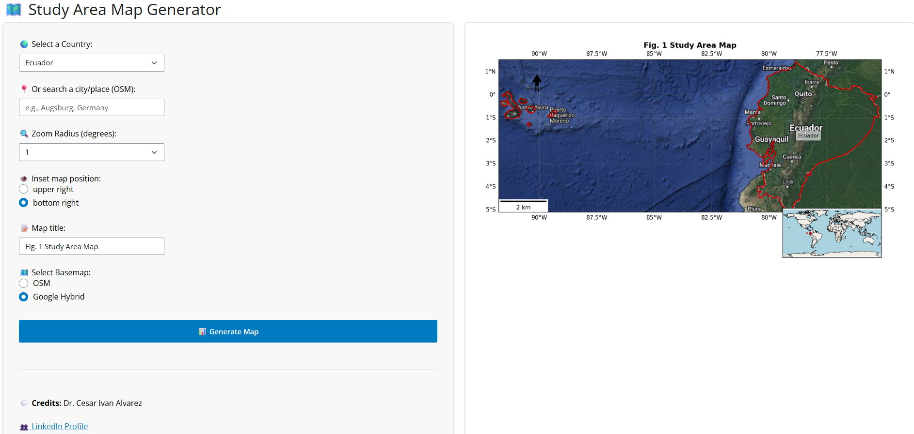
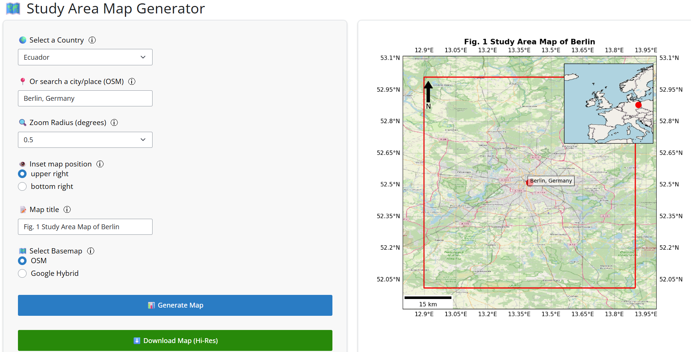

# 🗺️ Study Area Map Generator

**Study Area Map Generator** is a web-based Python Shiny application developed to help researchers, students, and educators generate **publication-ready maps** of countries or specific places. The tool is especially useful for scientific papers, theses, reports, and presentations where spatial context needs to be clearly communicated.

---

## 🧭 Features

- Select a country from a global list using a GeoJSON file  
- Alternatively, search for any city or location using OpenStreetMap (OSM)  
- Automatically zooms and centers on the selected area  
- Customize the map title  
- Choose inset map position (upper right or bottom right)  
- Switch between **OpenStreetMap** and **Google Hybrid** basemaps  
- Adjust zoom level for better spatial focus  
- High-resolution map outputs include:
  - Country or region boundaries  
  - North arrow  
  - Coordinate grid  
  - Scale bar  
  - Inset map for geographic context  

---

## 🚀 Live Demo

Try the app here:  
👉 [https://cesarivanalvarez.shinyapps.io/country-map](https://cesarivanalvarez.shinyapps.io/country-map)

We welcome your feedback to improve the tool. Please consider completing this short survey:  
👉 [https://forms.office.com/r/DTfbymb1nF](https://forms.office.com/r/DTfbymb1nF)

---

## 📷 Screenshots

### Country Selection Example  


### City Search Example  


---

## 🔧 Installation

You can run the app locally using **Python ≥ 3.10**.

### 1. Clone the Repository

```bash
git clone https://github.com/osoivan/country-map-generator.git
cd country-map-generator
```

### 2. Create a Virtual Environment

```bash
conda create -n country_map_app python=3.10
conda activate country_map_app
```

### 3. Install Requirements

```bash
pip install -r requirements.txt
```

### 4. Run the App Locally

```bash
python -m shiny run --reload app.py
```

Then open your browser at:  
[http://127.0.0.1:8000](http://127.0.0.1:8000)

---

## 📁 File Structure

```
country-map-generator/
├── app.py                                 # Main Shiny app
├── world-administrative-boundaries.geojson  # GeoJSON with country boundaries
├── requirements.txt                       # Python dependencies
├── docs/
│   ├── example_map_ecuador.png
│   └── example_map_berlin.png
├── README.md
```

---

## 📦 Dependencies

- [Shiny for Python](https://shiny.posit.co/py/)  
- GeoPandas  
- Cartopy  
- Matplotlib  
- geopy  
- matplotlib-scalebar  

---

## 🧠 Use Cases

- Create clear and consistent maps for study areas  
- Avoid the need for complex desktop GIS software  
- Ideal for:
  - Remote sensing projects  
  - Environmental and climate research  
  - Academic theses and fieldwork documentation  
  - Scientific publications and presentations  

---

## 👨‍💻 Authors

- **Dr. Cesar Ivan Alvarez** – University of Augsburg  
- **Dr. Ana Claudia Moreira** – University of Porto  
- **Dr. Izar Sinde** – Universidad Politécnica de Madrid  
- **MSc. Juan Gabriel Mollocana** – Universidad Politécnica Salesiana

📧 cesar.alvarez@uni-a.de  
🔗 [LinkedIn Profile](https://www.linkedin.com/in/cesar-ivan-alvarez-0847253a/)

---

## 📄 License

This project is licensed under the MIT License. See the [LICENSE](LICENSE) file for details.

---

⭐️ *If you find this project useful, please consider giving it a star on GitHub.*